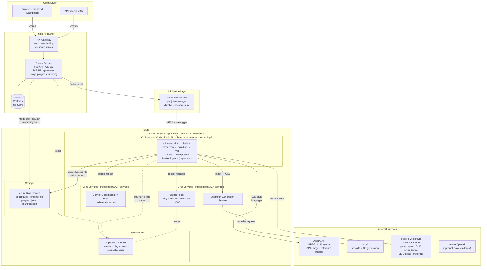

## Overview

I build across the full stack - from Python APIs through to cloud infrastructure and ML systems to TypeScript frontends and dashboards - with a focus on shipping AI-powered products that are reliable and scalable. My engineering work sits at the intersection of AI engineering, systems design, and DevOps, grounded in software engineering fundamentals.

---

## Case Study: Scalable Agentic 3D Scene Generation

The [Compositional 3D Scene Building](https://www.spatial-intelligence.co.uk/scene-generator) pipeline at [Spatial Intelligence](https://www.spatial-intelligence.co.uk/) generates production-ready 3D environments from natural language descriptions. Architecturally, the core challenge is that scene generation is multi-stage, GPU-bound, and highly variable in duration - making synchronous request handling unworkable at scale.

**Key design decisions:**

- **Async job queue** (Azure Service Bus) decouples the client-facing API from compute-intensive workers, providing durability and natural backpressure without coupling request latency to generation time
- **KEDA autoscaling** on Azure Container Apps scales the orchestrator worker pool directly from queue depth, keeping idle compute cost near zero while handling burst load
- **Stateless workers with externalised state** - all checkpoints and artifacts written to Blob Storage, with a `progress.json` manifest surfaced through the broker, so any worker replica can be interrupted or replaced without job loss
- **Independent GPU and CPU services** (Blender rendering pool, convex decomposition, geometry generation) run as separate ACA services and scale independently of the orchestrator, matching resource allocation to workload type
- **LLM orchestration** - GPT agents drive multi-stage scene planning; CLIP-indexed vector search (Weaviate) retrieves semantically relevant 3D objects and materials without manual curation

**Architecture diagram:**

---

## Stack

| Domain | Technologies |
|---|---|
| **Backend** | Python · FastAPI · REST |
| **AI / ML** | LLM orchestration · vector search · computer vision · PyTorch |
| **Cloud** | Azure (ACA · Service Bus · Blob Storage · Application Insights · Azure AI Foundry) · AWS (Lambda · S3) |
| **Containerisation** | Docker · Azure Container Registry |
| **Databases** | PostgreSQL · MongoDB · Redis · Weaviate |
| **Frontend** | TypeScript · Vue.js · React · Tailwind CSS |
