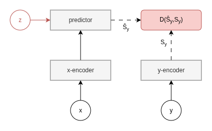
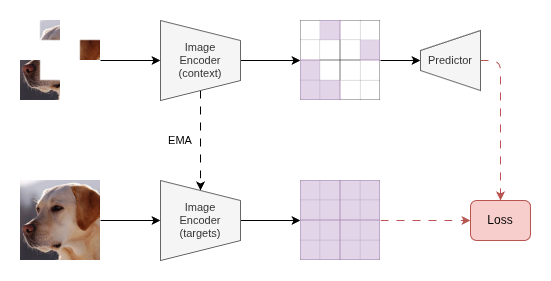
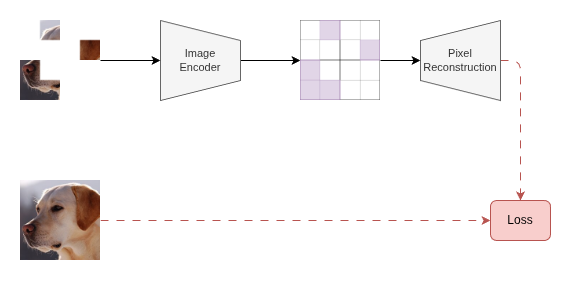
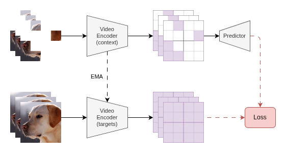

## Overview

A central challenge in self-supervised visual representation learning is determining what to predict. Pixel-level objectives are expressive but brittle: they force models to reconstruct low-level details that carry little semantic information, often at the cost of the higher-level structure that matters for downstream tasks. Joint-Embedding Predictive Architectures (JEPAs) offer a different answer  rather than predicting in pixel space, predict in representation space.

The core JEPA intuition is to train a model to predict the latent representation of one part of the world from another, without reconstructing the original signal. This shifts the learning objective toward semantic structure and away from irrelevant surface variation. An exponential moving average (EMA) target encoder  sometimes called a context encoder  provides stable prediction targets without collapse, removing the need for negative samples or contrastive objectives.

At its most general, a JEPA consists of two encoders  a context encoder and a target encoder  and a predictor. The context encoder processes a visible signal; the predictor maps its representation, conditioned on positional information, to the target encoder's representation of a masked region. The target encoder's weights are not trained directly but rather updated as an EMA of the context encoder, providing a slowly-moving, stable prediction target. Because no reconstruction into pixel space is required, the model is free to discard uninformative detail and learn semantically rich, structured representations.

---

## I-JEPA: Image Joint-Embedding Predictive Architecture

Image-JEPA (I-JEPA) instantiates this framework for static images. The input image is divided into non-overlapping patches. A subset of these patches is provided to the context encoder; the predictor then attempts to predict the target encoder's representations of the remaining masked patches, conditioned on their position. Crucially, the prediction targets are latent representations, not pixel values  the model is never asked to fill in texture or colour.

The masking strategy matters. I-JEPA uses large, block-structured masks, encouraging the predictor to reason over spatially coherent regions rather than local textures. This pushes the representations toward object-level and scene-level abstractions.

### Contrasting with MAE

Masked Autoencoders (MAE) pursue a superficially similar objective - masking image patches and recovering the missing information - but reconstruct in pixel space. This distinction has significant consequences.

Because MAE must reconstruct exact pixel values, the decoder is incentivised to model low-level texture and colour. The encoder representations are correspondingly biased: to support pixel reconstruction, they must retain fine-grained appearance information that is often irrelevant to semantic understanding. In contrast, I-JEPA's prediction targets are already encoded - they represent whatever abstraction the target encoder has learned, not the original pixels. The encoder can therefore afford to be more aggressive in discarding low-level detail, resulting in representations that are more linearly separable on semantic downstream tasks and more robust to texture-level perturbations.

In short: MAE reconstructs *what* the image looks like; I-JEPA predicts *how* the image is represented. The latter is a fundamentally more structured objective.

---

## V-JEPA: Extending to Video

V-JEPA scales the JEPA framework from static images to video, extending latent masked prediction into the temporal dimension. Tubes of patches - contiguous in both space and time - are masked, and the predictor must recover the target encoder's representations of the missing regions from visible context elsewhere in the clip.

This extension is non-trivial. Video introduces temporal redundancy and motion, and naive masking strategies allow models to trivially copy nearby frames. V-JEPA addresses this through aggressive spatiotemporal masking, forcing the model to reason about dynamics and temporal coherence rather than simple interpolation. The result is representations that encode not just appearance, but change - an important property for any downstream task involving motion or interaction.

V-JEPA demonstrates that the JEPA framework is not image-specific: the principle of latent masked prediction generalises to higher-dimensional data, and the representations it yields carry correspondingly richer structure.

---

Reference implementations of I-JEPA and V-JEPA to support research can be found at [github.com/yunusskeete/jepas](https://github.com/yunusskeete/jepas).

---

## IT-JEPA: Towards Multi-Modal JEPA

*(Conducted in collaboration with the University of Bristol.)*

V-JEPA's extension to video raises a natural question: how far does the JEPA paradigm generalise? Images and video are both visual signals - they share the same spatial structure and the same patch-based inductive biases. The more fundamental challenge is whether latent masked prediction can serve as an alignment mechanism *across modalities* - between signals that differ not just in dimensionality but in the nature of what they represent.

Image-Text JEPA (IT-JEPA) investigates this question in the image-language setting, one of the most practically significant multi-modal domains.

Rather than aligning image and text representations through contrastive objectives - as in CLIP and its descendants - IT-JEPA explores a JEPA-style predictive alignment: can a model learn to predict the latent representation of one modality from the other, using the energy-based self-distillation mechanism that has proven effective within single modalities? This pursuit is motivated by four research questions:

1. **Cross-Modal Latent Alignment:** Can a JEPA-style masked latent prediction objective effectively align image and text representations in a self-supervised manner, without contrastive negative samples?
2. **Semantic Grounding via Prediction:** Does predicting across the image-text boundary encourage representations that encode semantic correspondence rather than surface co-occurrence?
3. **Inductive Bias Transfer:** To what extent do the spatial inductive biases embedded in masked image modelling survive - or degrade - when prediction targets are drawn from a fundamentally non-spatial modality such as natural language?
4. **Representational Asymmetry:** How should architectural asymmetries between image and text encoders be handled within a shared predictive objective, and does the choice of prediction direction - image-to-text versus text-to-image - affect the character of learned representations?

IT-JEPA sits at the intersection of the representational questions raised by I-JEPA and the modality-extension questions raised by V-JEPA. It frames multi-modal alignment not as a retrieval or contrastive problem, but as a predictive one - asking whether the structured, energy-based objectives that work so well within a single modality can be the foundation for a general framework of multi-modal representation learning.