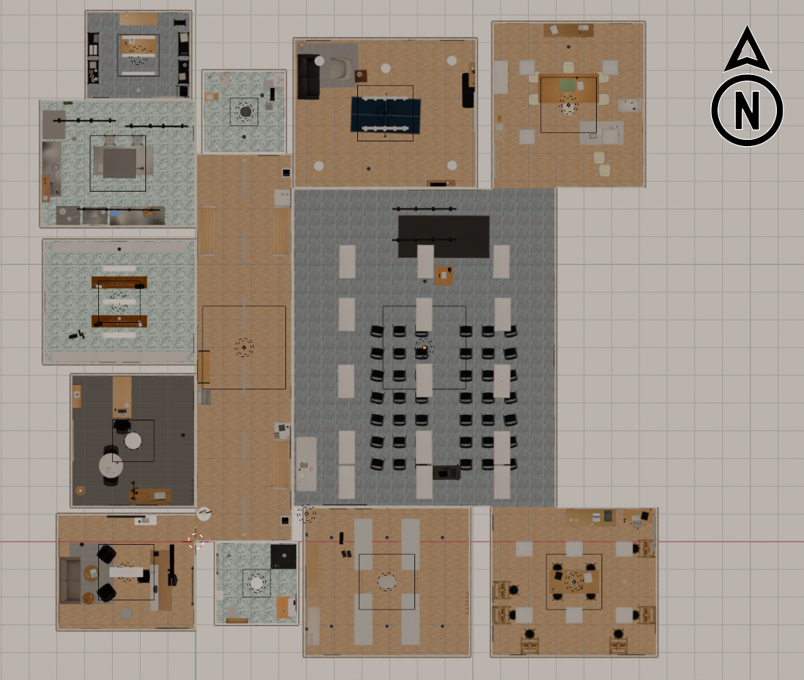
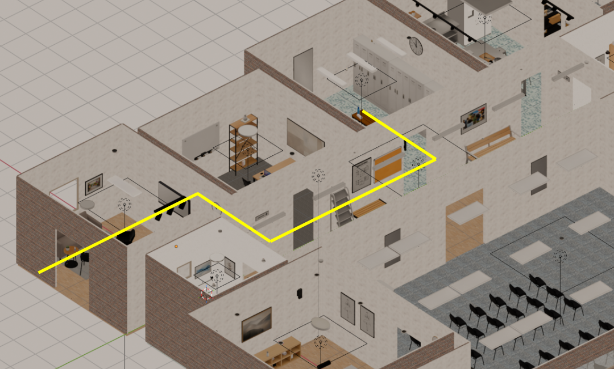
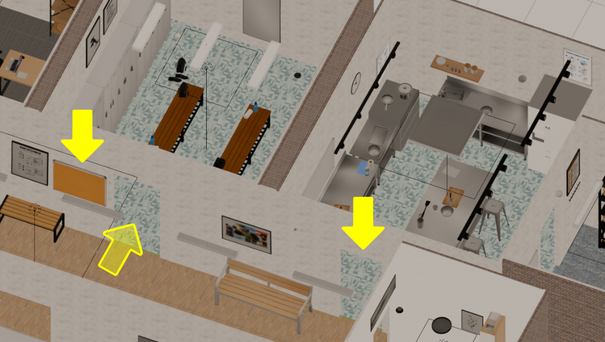
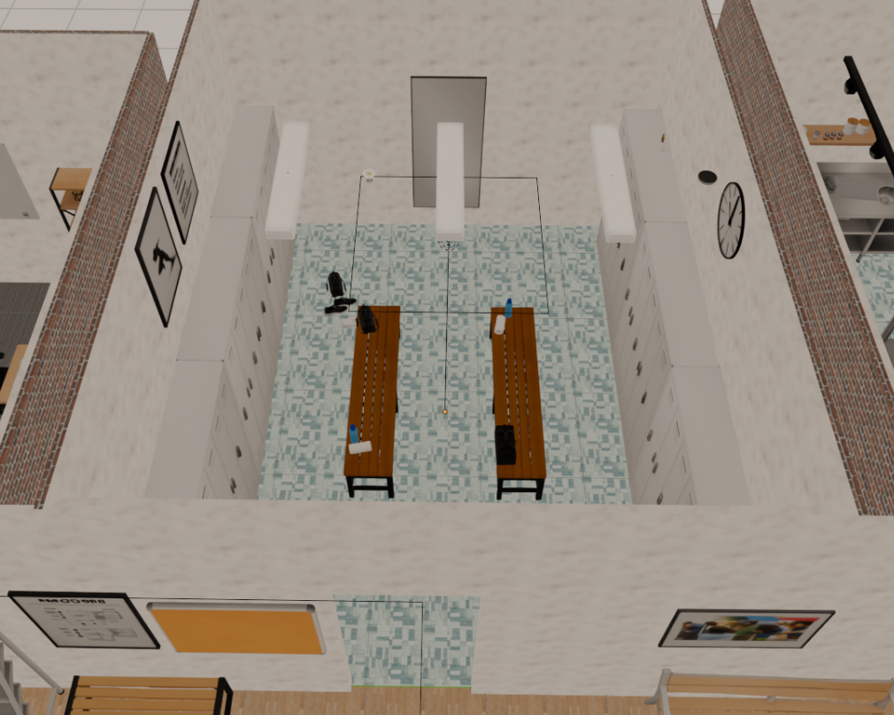
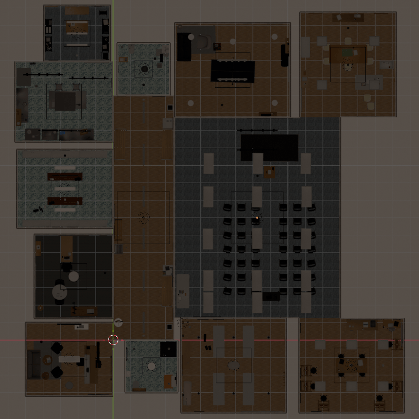

> A protocol for AI agents that understand the physical world — able to navigate buildings, identify locations, and control their environment in real time.

*(Conducted as Founder & CEO of [Spatial Intelligence](https://www.spatial-intelligence.co.uk/))*

## Overview

The Spatial Context Protocol (SCP) enables any building to be represented as a compact, LLM-interpretable spatial model. Lightweight enough to run on modest hardware, the model grounds an AI agent in the physical world — giving it native understanding of position, routes, visual landmarks, and live state within a space.

As buildings increasingly expose programmatic interfaces — sensors, lighting systems, access control, climate — SCP provides the layer through which agents natively understand and act within them. Rather than treating building control as a bolt-on integration, SCP unifies spatial reasoning and system control: an agent can observe live state, answer natural language queries, and operate building systems in real time, without a database or vector store.

The spatial model is the only thing that changes between buildings. Author a model for a new location and the same agent is immediately deployable there, with no additional infrastructure or specialist tooling required.

## Examples

The examples below use a 13-room multi-functional building as a demonstration, generated from a single text prompt using Spintel - a 3D scene generation pipeline from [Spatial Intelligence](https://www.spatial-intelligence.co.uk).

### Example 1 — Natural language wayfinding

> **Query:** *"How do I get from the entrance to the changing room?"*

> **Response:** *"From the entrance lobby, walk north through the opening in the north wall and follow the corridor to the main junction. At the junction, turn to face the west wall and take the third doorway from the south - between the orange noticeboard and the kitchen door - into the changing room. Total distance: approximately 13.9 m."*

The agent traverses the building as a human would, identifies the two-hop route, and produces turn-by-turn directions with named landmarks. Although routes can be cached for efficiency, the agent has no pre-computed routes — real-time traversal of the underlying spatial model underpins the system and enables deployment across multiple venues.

---

### Example 2 — Location identification from description

> **Query:** *"I'm not sure where I am. I can see grey metal lockers and a bench running down the middle of the room."*

> **Response:** *"You are in the **Changing Room** - identified from the grey metal lockers lining the north and south walls and the benches running down the centre. To reach the building exit: go east through the doorway into the main corridor junction, then turn south and follow the corridor to the entrance lobby, approximately 14m total."*

The agent matches a natural language description against its spatial model, identifies the room without being told where the user is, and offers directions to the exit. The same mechanism handles "where can I find somewhere quiet to work?" and similar intent-based queries.

---

### Example 3 — Route-conditioned building control

> **Query:** *"Find me a path to the lounge. Can you turn on the lights for every room I'll pass through on the way?"*

> **Response:** *"From the entrance lobby, head north through the opening in the north wall into the main corridor. At the corridor junction, turn east and pass through the wide opening into the large briefing and training room. Continue north through the northwest opening in the north wall into the lounge and breakout area - the ping-pong table is in the centre of the room. Lights have been turned on throughout: entrance lobby, corridor, briefing room, and lounge."*

The agent traverses the building in real-time as a human would, reasoning step-by-step about the live state of the building. It interacts with the building control layer to activate lights as it passes through rooms. Building control is simulated via API calls — exposed via location-specific agent tools — and the spatial model carries live state and building control through the same underlying system.

---

## Building the spatial model

A building is described to the system from simple inputs — a walkthrough video, photographs, or a basic floorplan. The generated spatial model is compact, human-readable, and maintainable without specialist tooling. Crucially, it is the single source of truth for both the agent and building managers: the same model that drives navigation also carries live state and building control integrations.

The authoring process is on a path toward a guided, near-automated workflow from a video walkthrough or existing floorplan — making SCP deployable at scale across any building, without bespoke engineering for each location.

---

SCP spatially grounds AI agents for the first time — enabling them to assist with genuinely 3D tasks, and marking a step toward agents that can inhabit and operate autonomously in the physical world.
