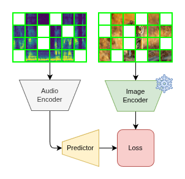
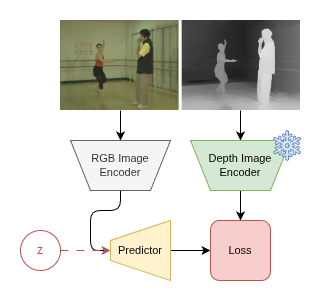

## Overview

Spatial intelligence \- the capacity to understand, reason about, and act within three-dimensional environments \- sits at the intersection of perception, representation, and action. It underpins some of the most ambitious open problems in AI: generalising from visual observation to physical interaction, learning the geometry of the world without explicit supervision, and building models that organise knowledge the way humans do \- through objects.

This overview traces a research programme motivated by a foundational observation: current world models are biased toward appearance over structure. They describe what the world looks like without capturing how it is organised \- the geometric relationships, persistent entities, and causal regularities that make spatial reasoning possible. Closing this gap is the central ambition of the work presented here.

The programme unfolds in two stages. The first investigates whether energy-based, self-supervised objectives \- specifically Joint-Embedding Predictive Architectures (JEPAs) \- can serve as general-purpose mechanisms for learning spatially and geometrically structured representations across modalities. The second asks the next-order question: given structured representations, can we learn unified, object-centric world models from passive observation alone that support not just perception, but generation and physical interaction?

The thesis connecting both stages is that object-centricity is the missing organising principle of spatial AI. Humans understand, imagine, and act upon the world through coherent, persistent object-level representations. Building artificial systems with equivalent structure \- and learning those representations from the world as it is, rather than from datasets as we have been able to annotate them \- is the research horizon toward which this work points.

## 1\. Structure Representations from Multi-Modal World Models

### Motivation

A central limitation of current world models is their bias toward content over structure. Generative and visual world models have made remarkable progress in capturing the appearance and semantics of the world, yet they largely fail to represent its underlying geometric, spatial, and causal structure \- the properties that matter most for grounded reasoning and generalisation. This family of research projects investigates Joint-Embedding Predictive Architectures (JEPAs) and latent-variable energy-based models as a framework for learning structured, spatially grounded representations in a self-supervised manner. By extending the JEPA paradigm into multi-modal settings \- across image, audio, and depth \- we explore whether masked latent prediction can serve as a general-purpose mechanism for distilling not just what the world looks like, but how it is structured. These projects lay the self-supervised representational foundations for world models that understand structure alongside content, bridging toward a subsequent programme of work in object-centric world modelling.

### A\. Image-Audio JEPA: Towards self-supervised spatial audio via masked latent prediction

*(Conducted in collaboration with the University of Bristol.)*

This project investigates whether the JEPA-style masked latent prediction objective \- an energy-based self-distillation mechanism \- can serve as a general-purpose framework for aligning visual and auditory representations in a spatially grounded, self-supervised manner. While contrastive and attention-based objectives have been widely explored for multimodel alignment, the use of an energy-based self-distillation objective across modalities remains hitherto underexplored. We investigate four research questions:

1. **Self-Supervised Image-Audio Alignment:** Can a JEPA-style masked latent prediction objective effectively align image and audio representations in a spatially grounded, self-supervised manner?  
2. **Spatial Inductive Biases in Vision:** To what extent does masked image modelling \- via patch-based latent reconstruction \- serve as an effective pretraining strategy for spatially grounded downstream tasks such as visual sound localisation?  
3. **Cross-modal Transfer of Spatial Structure:** Can cross-modal self-supervised alignment via a multimodal JEPA extend the spatial inductive biases of masked image modelling to multimodal settings?  
4. **Representation Effects in Audio:** How does the choice of audio representation \- waveform versus spectrogram \- affect the ability of self-supervised models to learn spatially aligned cross-modal representations?

#### Preliminary Findings

Training on VGGSound, the JEPA objective successfully aligned image and audio representations in a self-supervised manner, validating the core alignment mechanism across modalities. The most revealing finding concerns the role of audio representation. Spectrogram-based models substantially outperformed waveform-based models on visual sound localisation \- a result we interpret as evidence that spectrograms, as 2D time-frequency images, preserve the spatial inductive biases intrinsic to masked image modelling. Because masked image modelling operates over spatial regions, the model learns which frequency components of sound correlate with which spatial image regions, mapping naturally onto localisation. Waveforms, as 1D temporal signals, do not support this spatial structure, and the inductive biases fail to transfer. This indicates that masked image modelling encodes strong spatial inductive biases \- hitherto underexplored \- and that these biases are a key driver of performance on spatial reasoning tasks such as spatial sound localisation. Further quantifying the contribution of spatial inductive biases in isolation, and the degree to which cross-modal alignment extends them, are important directions for future work.

### B\. Image-Depth JEPA: Latent Variables for Geometric World Modelling

*(Conducted in collaboration with the University of Bristol.)*

Despite the success of JEPAs in distilling rich visual representations, the latent self-prediction objective remains biased toward content rather than structure. The original JEPA formulation proposed latent variables as a mechanism for enriching the captured world model, yet this direction remains unexplored in the literature. Latent variables have demonstrated capacity to capture implicit structure within input signals \- including in geometric disambiguation and spatial reasoning \- suggesting they may be well-suited to encoding the structural properties that standard world models can overlook. This project trains and evaluates a multi-modal latent-variable JEPA \- an energy-based world model \- on paired image and depth inputs, investigating four research questions:

1. **Cross-Modal Alignment via JEPA:** Can a JEPA-style latent prediction objective effectively align image and depth representations in a self-supervised manner?  
2. **Latent Variables and Implicit Structure:** Do latent variables improve a JEPA's ability to capture implicit geometric structure within visual inputs \- such as depth discontinuities and surface boundaries?  
3. **Stochastic World Modelling and OOD Generalisation:** Does a latent-variable formulation \- enabling a stochastic, causal model of the world rather than a deterministic input-output mapping \- improve generalisation to out-of-distribution inference settings?  
4. **Downstream Spatial Reasoning:** Does the geometric structure distilled via a latent-variable JEPA transfer to downstream tasks such as monocular metric depth estimation, particularly in structurally challenging scenarios?

#### Preliminary Findings

While the introduction of latent variables increases training complexity and introduces instability, preliminary results on the [NYUv2 dataset](https://cs.nyu.edu/~fergus/datasets/nyu_depth_v2.html) offer supporting evidence for the core hypothesis. Latent-variable models converged substantially faster on monocular metric depth estimation, and exhibited markedly better structural fidelity in challenging scenarios \- most notably at depth discontinuities such as doorways, where deterministic models typically produce blurred or incoherent boundaries. Critically, latent-variable models also demonstrated improved generalisation to out-of-distribution settings, with models trained on indoor scenes (NYUv2) showing stronger transfer to outdoor inference than their deterministic counterparts. We interpret these results as preliminary evidence that latent variables enable a richer, stochastic model of geometric world structure \- one that better captures the causal ambiguity inherent in tasks like monocular depth estimation \- rather than learning a brittle input-output mapping. Addressing training instability, scaling the evaluation across more diverse depth benchmarks, and quantifying the alignment between image and depth representations are key directions for future investigation.

## 2\. From Structured Representations to Object-Centric World Models

The projects above establish a foundational result: masked latent prediction, extended into multi-modal settings via an energy-based objective, is an effective self-supervised mechanism for distilling spatially and geometrically structured representations from visual data. Crucially, these representations encode how the world is structured \- not merely how it appears. The spectrogram findings demonstrate that spatial inductive biases can be preserved and transferred across modalities; the latent-variable depth results suggest that stochastic world models better capture the geometric ambiguity and causal structure of real environments.

Yet structured representations alone are insufficient for general spatial intelligence. A world model that understands geometry without understanding objects \- the discrete, persistent entities through which humans organise spatial knowledge and plan action \- remains fundamentally limited. The programme of work that follows takes these self-supervised foundations and asks the next-order question: can we learn unified, object-centric representations from passive observation alone that support not just perception, but generation and physical interaction? This reframes spatial AI around the same organising principle that underlies human spatial reasoning \- and represents the natural continuation of the representational agenda established here.

## 3\. Towards Unified Spatial Intelligence: An Object-Centric Foundation

### Motivation

The preceding work establishes that self-supervised, energy-based objectives can distil structured spatial representations from visual data \- encoding geometric relationships, spatial inductive biases, and causal world structure without explicit supervision. But representation quality alone does not constitute spatial intelligence. The deeper architectural challenge is one of organisation: current systems lack a coherent principle for structuring spatial knowledge in a way that supports understanding, generation, and physical interaction within a single unified model.

We propose that the missing organising principle is object-centricity. Humans understand, imagine, and act upon the world through persistent, discrete object-level representations that integrate semantic identity, spatial geometry, and relational context. Current AI systems have no equivalent \- vision models that recognise objects cannot inform generative models about physical plausibility; generative models cannot guide robotic manipulation; manipulation systems cannot leverage visual understanding from internet-scale observation. Each domain operates in isolation, and the cross-domain transfer essential for general spatial intelligence remains out of reach.

### Core Hypothesis

Human spatial intelligence suggests a fundamental organising principle: the world is understood, imagined, and acted upon through coherent object-level representations that integrate semantic identity, spatial properties, and relational context. Adopting this approach in artificial spatial intelligence fundamentally reframes spatial AI: rather than building separate systems for detection, scene generation, and manipulation, we seek architectures that learn general-purpose object representations supporting all three domains through natural observation.

### Relation to Existing Approaches

Object-centric learning with methods like SLOT attention have shown promise, demonstrating compositional reasoning on synthetic data, however scaling these approaches to real-world complexity remains an open challenge. Similarly, neural scene representations \- NeRFs, Gaussian Splatting \- capture impressive visual and spatial detail but lacks explicit object-level structure or semantic understanding. Our approach differs in several key dimensions:

1. End-to-end learning of object-level knowledge designed to transfer from observation to generation and interaction  
2. Development of spatial and multi-view priors for integration with scene-level and object-level representations  
3. Focus on self-supervised learning for compatibility with internet-scale visual data rather than heavily annotated datasets

### From Observation to Interaction: The Transfer Challenge

Datasets like [Ego4D](https://ego4d-data.org/) and [EPIC-Kitchens](https://epic-kitchens.github.io/) capture massive-scale human interaction from egocentric perspectives, revealing how objects respond to manipulation, what configurations are achievable, and which grasps succeed. Yet current robotic systems cannot leverage these observations for interaction learning \- they require extensive embodiment-specific task demonstrations, suggesting a fundamental gap in how they represent and reason about the physical world.

The core challenge is architectural: designing object representations that unify perception, generation, and interaction. Rather than learning embodiment-specific action sequences, systems should develop rich object-centric priors that ground planning on functional understanding-semantic identity, spatial geometry, typical interaction patterns, and state dynamics. This reframing shifts the burden from memorising actions to understanding outcomes, potentially reducing embodiment-specific data requirements by orders of magnitude.

Such unified representations raise critical questions about the transfer from passive observation to active manipulation:

1. Can systems learn robust spatial primitives from passive observation with geometric self-supervision alone?  
2. Can actionable object affordances and interaction outcomes be learned from observing human manipulation without embodiment-specific experience?  
3. How much embodiment-specific data is required to ground learned interaction priors in a physical robot?

### Research Agenda, Open Questions, and Conclusion

The vision outlined above suggests a path toward foundation models for spatial intelligence \- systems pre-trained on video data to develop general-purpose object-centric representations supporting diverse downstream applications. Successfully realising this vision could transform multiple fields: manipulation in unstructured environments, realistic AR/VR with coherent physical relationships, navigation in complex dynamic settings, and intelligent spatial reasoning for design and simulation. The key differentiator from current approaches is unified learning \- rather than training separate models for each application, a single foundation model develops spatial intelligence transferable across domains through shared object-centric representations.

Human spatial intelligence achieves exactly this: seamlessly integrating understanding, imagination, and action through coherent object-level representations developed primarily from observation. Current AI systems lack this integration \- treating spatial reasoning as a collection of separate problems requiring distinct architectures, training paradigms, and supervision signals. Several fundamental questions must be resolved to close this gap:

* **Compositional generalisation:** Can understanding of semantic, spatial, and relational primitives combine to reason about novel object configurations not seen during training?  
* **Physical reasoning:** Do learned spatial constraints implicitly capture physical properties such as stability, support relationships, and interaction dynamics?  
* **Transfer efficiency:** How much task-specific data is required when leveraging rich spatial priors learned from observation \- and does the answer change meaningfully across domains?  
* **Architectural choices:** What design decisions enable learning actionable representations from passive observation, and how should systems handle non-object entities \- deformables, surfaces, granular materials \- that resist object-centric description?  
* **Evaluation:** What frameworks measure genuine spatial understanding rather than task-specific performance proxies?

These questions span the full arc of the research vision presented here \- from the self-supervised, energy-based foundations that establish how structure can be learned, through to the object-centric architectures that ask how that structure should be organised. Fundamental breakthroughs in architecture, training, and evaluation remain necessary. But the trajectory is clear: spatial intelligence that approaches human-level flexibility and generalisation will be built on unified, object-centric representations learned from the world as it is \- not from datasets as we have been able to annotate them.